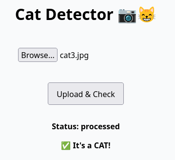
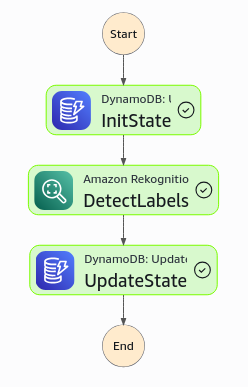
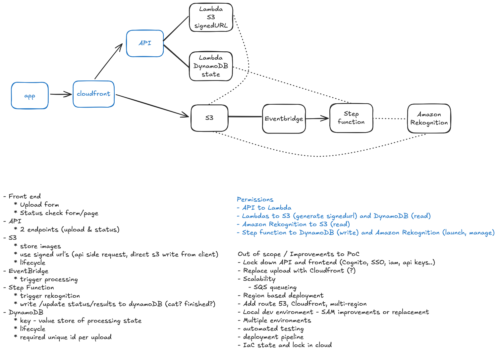

# Cat Detect

_Does the image file provided contain a cat?_



Simple service implementation to check if a given image file (jpeg/png)
contains the image of a cat.

* Using AWS Services
* Serverless application
* IaC in Terraform
* Implemented in Python (Lambdas functions)
* Stateful: Amazon DynamoDB for data and Amazon S3 for storage
* Amazon Rekognition for image recognition 
* Simple user interface for testing (HTML and Javascript)


## Notable Features:

* Terraform for IaC and..
* Lambda and Static content deployment using Terraform
* S3 pre-signed urls for uploads
* TTL for artifacts (S3) and state (DynamoDB) 
* JSONata in Step Functions
* Cloudfront distribution with S3 and API Gateway origins




## Next Steps

* Multiple environments & IaC refactoring
* CI/CD for code bases
* CI & Remote state and lock for Terraform (Terraform Cloud, self-hosting, etc.)
* Resource tagging
* Logs rotation
* Alerting & monitoring
* Application improvements:
    * Caching / queues
    * Multi region support
    * Express Step Functions
    * Managed User Access
    * Errors handling

## Requirements

* AWS Account (https://aws.amazon.com/console/) and
* IAM user credentials for the AWS CLI (https://docs.aws.amazon.com/cli/v1/userguide/cli-authentication-user.html)
* Terraform client (https://developer.hashicorp.com/terraform/install)
* Pictures of your cat.

## Deployment

This PoC/MVP is deployed using IaC:

```bash
cd terraform/cat_check/
terraform init
terraform apply
```

The frontend interface can be accessed by opening the output cdn domain

```bash
terraform/cat_check$ terraform apply
(...)
Apply complete! Resources: 40 added, 0 changed, 0 destroyed.

Outputs:

cdn_domain = "dwx1rot6v72uv.cloudfront.net"
```

To clean up the environment, run `terraform destroy`.

## Other notes

The `samples` directory contains testing images.


## (Some) References



* [Single CloudFront distribution for S3 web app and API Gateway](https://dev.to/evnz/single-cloudfront-distribution-for-s3-web-app-and-api-gateway-15c3)
* [Securely Delivering Amazon S3 Content via CloudFront](https://medium.com/@murtz/securely-delivering-amazon-s3-content-via-cloudfront-9bf83486d0ad)
* [Adding a DynamoDB TTL with step functions](https://chazede.dev/posts/sfn-dynamo-ttl/)
